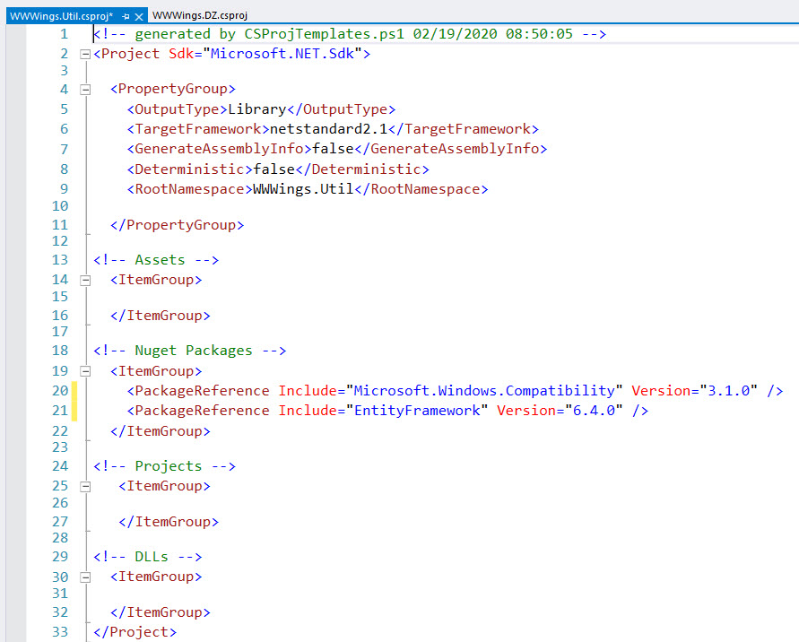

# .NET Framework to .NET Core Migration PowerShell Script
A PowerShell Script for the Migration of C#-based .NET Framework projects to .NET Core.
- creates a clean SDK-style project file (.csproj) in a new folder
- customizable templates for project file
- copies all files from the original folder except /bin, /ob, .sln, .csproj and .vspscc
- handles all files in the /Assets folder as Resource
- migrates icon, rootnamespace, project references and packages references from original project
- includes the Windows Compatibility Pack by default
- does NOT set any build action (e.g. for EDMX, Typed DataSets)
- does NOT exclude any files
- does NOT integrate any other project settings e.g. Build Events
- you can easily change these defaults or add additional settings

# Supported Project Types
- WPF
- Windows Forms
- Console
- Library
- Unit Tests

# Not supported yet
- Webprojects (ASP.NET)

# Installation

1. Make sure you enabled PowerShell scripts on your system (e.g using: set-executionpolicy unrestricted)
2. Running the script as administrator will register the script in the Windows Explorer context menu for .csproj files.

# Running the script

Select a .csproj file in Windows Explorer and choose "Migrate this C#-Project to .NET Core" in the context menu.

